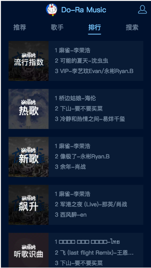
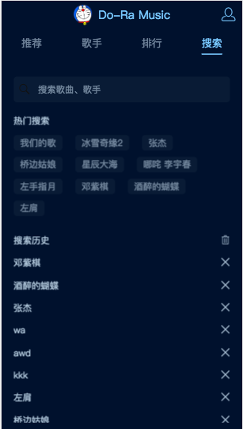
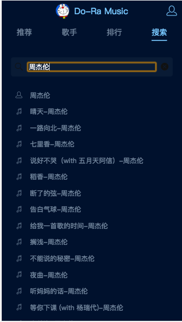

# musicplayer

## 项目运行
```
git clone https://github.com/mofaEb/musicplayer.git

npm install

cd musicplayer

npm run serve

```

## 页面展示
---
### 推荐页面


---
### 歌手页面


---
### 排行页面




---
### 搜索页面




---
### 用户中心


---